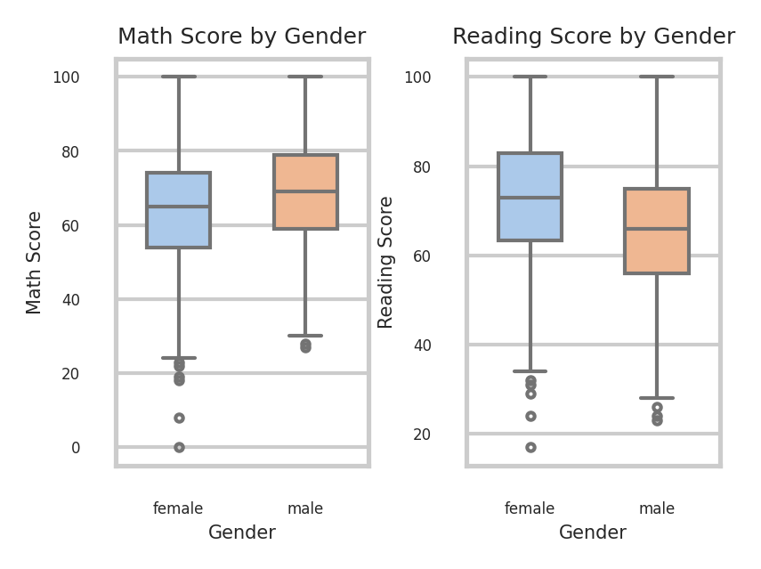
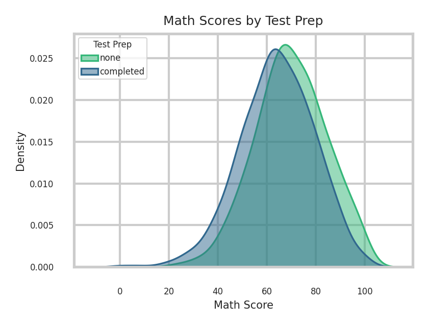
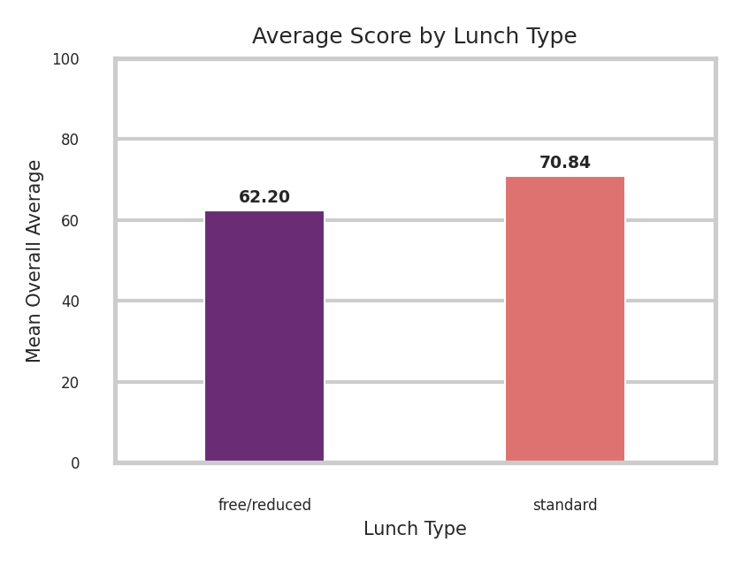
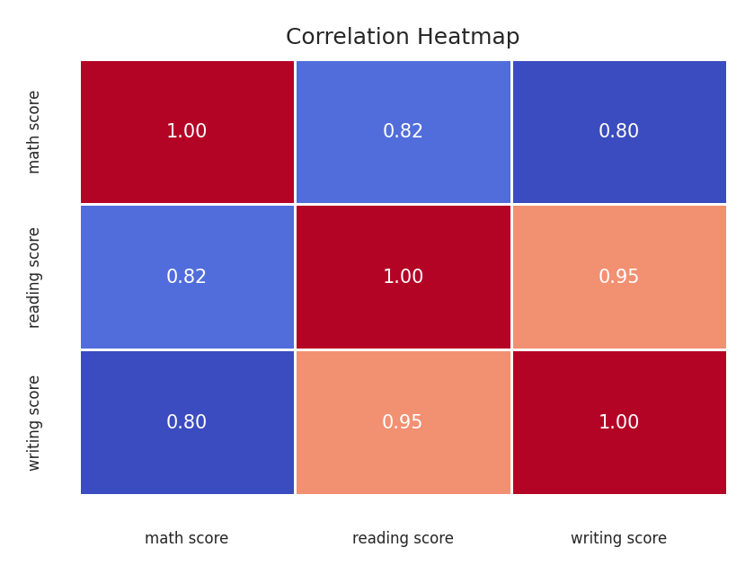
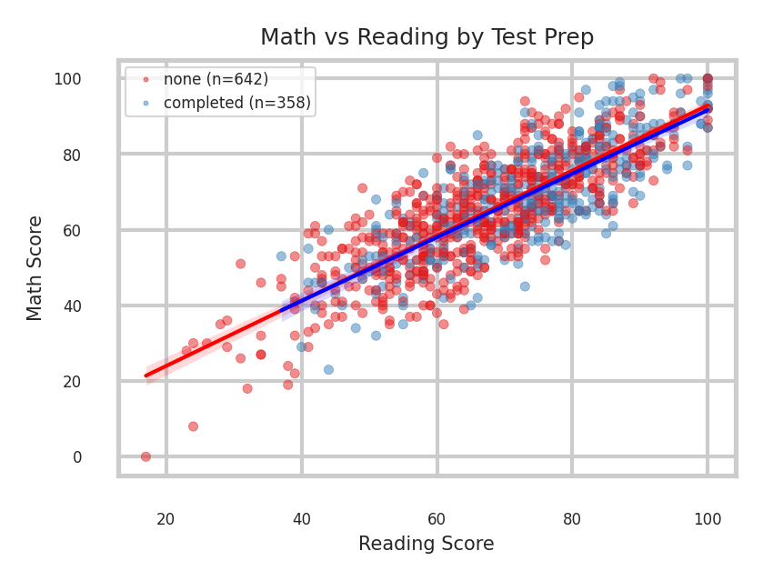

# Student Performance Data Visualization - Comprehensive Report

This report presents exploratory data visualizations and detailed analytical interpretations for the Student Performance dataset. The dataset underwent ingestion and preprocessing checks (confirming no missing values across all 1,000 student records) prior to visual analysis. All visual assets are formatted at 300 DPI high resolution with readable scales, explicit unit labels, titles, and legends.

---

## Visualization 1 (V1): Gender Differences in Math vs. Reading

### Research Question
*Are there gender differences in math vs reading?*

### Interpretation (7 Sentences)
1. The side-by-side boxplots reveal noticeable and divergent gender differences across mathematics and reading performance.
2. In mathematics, male students achieve a higher median score of approximately 69 compared to approximately 65 for female students.
3. The overall interquartile range for males is similarly elevated in math, demonstrating that the middle fifty percent of male scores lies above that of females.
4. Conversely, reading scores exhibit the opposite pattern, with female students substantially outperforming male students across all quartile benchmarks.
5. The median reading score for females is approximately 72, which is noticeably higher than the male median of approximately 66.
6. Furthermore, the lower quartile boundary for females in reading is positioned higher than that of their male counterparts.
7. In summary, the visualization highlights subject-specific disparities where males exhibit an advantage in mathematics while females demonstrate a pronounced advantage in reading comprehension.

---

## Visualization 2 (V2): Test Preparation Impact on Mathematics

### Research Question
*Do students who completed test prep score higher in math?*

### Interpretation (7 Sentences)
1. The kernel density estimation plot provides clear empirical evidence that completing a test preparation course positively impacts student mathematics outcomes.
2. Students who completed the preparation course exhibit a score distribution that is distinctly shifted toward higher values relative to students who took no preparation.
3. The modal peak for the course completion group is situated notably higher on the score axis than the peak for the non-completion group.
4. In contrast, students who did not participate in test preparation display a pronounced left tail with greater density across lower and failing score intervals.
5. The mean mathematics score for participants completing test preparation is approximately 69.7, compared to an average of only 64.1 for those without preparation.
6. Although considerable score overlap exists between both cohorts, completing the preparatory curriculum significantly reduces the frequency of severe underperformance.
7. Consequently, the data confirms that test preparation is associated with superior academic performance and a notable upward shift in math achievement.

---

## Visualization 3 (V3): Lunch Type and Academic Performance

### Research Question
*Does lunch type (standard vs free/reduced) relate to outcomes?*

### Interpretation (7 Sentences)
1. The analysis demonstrates a strong and consistent relationship between student lunch type and overall academic performance.
2. Students receiving standard lunch achieve a mean overall average score of 70.84 across math, reading, and writing subjects.
3. In contrast, students receiving free or reduced-price lunch achieve a substantially lower mean overall average score of 62.20.
4. This represents an average performance disparity of nearly nine percentage points separating the two socioeconomic student groups.
5. When evaluating individual academic disciplines, students with standard lunch maintain a decisive scoring lead across mathematics, reading, and writing alike.
6. Because subsidized lunch eligibility serves as an established institutional proxy for household income level, this outcome reflects systemic socioeconomic achievement disparities.
7. Overall, the visualization demonstrates that access to standard lunch is strongly correlated with higher composite academic success.

---

## Visualization 4 (V4): Subject Score Correlations

### Research Question
*How strongly do the three subjects move together?*

### Interpretation (7 Sentences)
1. The correlation heatmap illustrates strong, positive, and statistically robust linear associations among all three tested academic subjects.
2. The strongest observed relationship occurs between reading and writing scores, exhibiting a near-perfect correlation coefficient of $r = 0.95$.
3. Mathematics also demonstrates a substantial positive correlation with reading at $r = 0.82$ and with writing at $r = 0.80$.
4. All pairwise correlation coefficients exceed 0.80, proving that high achievement in any single academic discipline is accompanied by high achievement in the others.
5. This high degree of collinearity indicates that core cognitive, analytical, and study skills generalize effectively across distinct subject domains.
6. The exceptionally high correspondence between reading and writing underscores that literacy skills function as mutually reinforcing pedagogical proficiencies.
7. In conclusion, student performances across math, reading, and writing move together in high synchrony throughout the entire student population.

---

## Visualization 5 (V5): Math vs. Reading Association & Regression Slopes by Test Prep

### Research Question
*How strongly are math and reading scores associated, and do students who completed the test-preparation course have a different slope in the math–reading relationship than those who did not?*

### Interpretation (7 Sentences)
1. The scatter plot reveals a tight, positive linear trajectory confirming that reading and mathematics scores are strongly associated ($r = 0.82$).
2. Both student cohorts—those completing test preparation ($n = 358$) and those with no preparation ($n = 642$)—display tightly clustered data points around their respective linear regression lines.
3. Comparing the regression slopes reveals that the two best-fit lines are virtually parallel to one another across the entire score domain.
4. This parallel alignment demonstrates that the rate at which mathematics score scales with reading proficiency is nearly identical regardless of preparation status.
5. However, there is an evident vertical intercept shift where the regression line for test-prepared students is positioned higher than that of non-prepared students.
6. This upward elevation indicates that for any identical reading score, a student who completed test preparation is expected to score higher in mathematics.
7. Therefore, while test preparation does not fundamentally alter the slope between reading and math, it provides a uniform score premium across all achievement tiers.
